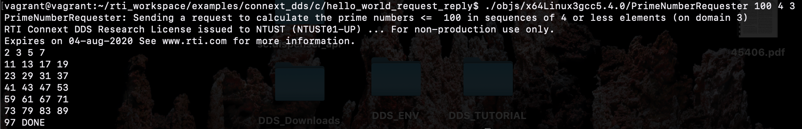

# Basic DDS Tutorial

- Create Vagrant Stack

```
vagrant up
vagrant ssh
password : vagrant
```

- Install DDS

```
sudo chmod 700 rti_connext_dds-6.0.0-eval-x64Linux3gcc5.4.0.run
./rti_connext_dds-6.0.0-eval-x64Linux3gcc5.4.0.run
```

- Setting Env & Create workspace

```
export NDDSHOME=$HOME/rti_connext_dds-6.0.0
export PATH=$PATH:$NDDSHOME/bin
export LD_LIBRARY_PATH=$NDDSHOME/lib/x64Linux3gcc5.4.0
rtipkginstall
```

## Test Helloworld

```
cd $HOME/rti_workspace/examples/connext_dds/c/hello_world
make -f make/makefile_HelloWorld_x64Linux3gcc5.4.0 
```
To connect,each DataWriters and DataReaders must have :

- the same Topic of the same DDS data type and be members of the same DDS domain. 
- Each DDS domain has a unique integer domain ID.

- Test Run:

	```
	 ./objs/x64Linux3gcc5.4.0/HelloWorld_subscriber <Domain_ID> <Number_of_Samples>
	 ./objs/x64Linux3gcc5.4.0/HelloWorld_publisher <Domain_ID> <Number_of_Samples>
	```

> **Parameters** :
> 
> * `<Domain_ID>`: specific domain ID {default : 0}
> * `<Number_of_Samples>`: number of samples to publish before terminating. 

 
 

## Test Helloworld request & reply

```
cd $HOME/rti_workspace/examples/connext_dds/c/hello_world_request_reply
make -f make/makefile_RequestReplyPrimes_x64Linux3gcc5.4.0 
```

- Test Run: 

	```
	objs/<architecture>/PrimeNumberReplier [<domain_id>]
	objs/<architecture>/PrimeNumberRequester <n> [<primes_per_reply> [<domain_id>]]
	```
 
 
 